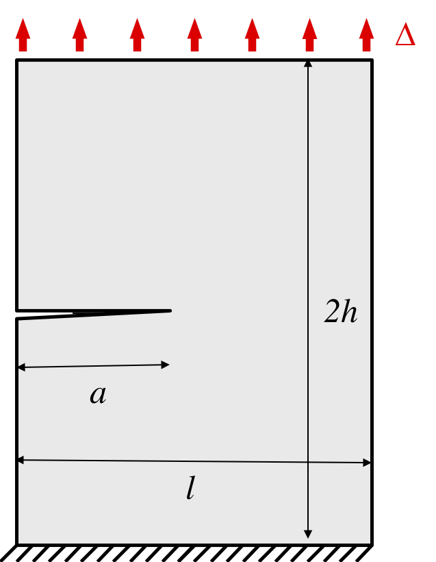

# Homework (Devoir Maison)

## General information

- We will assign task to complete progressively during the course. 
- We will ask you to submit your work only at the end of the class.
- We will evaluate your work only at the end of the class.
- Submitting the homework is optional
- The final grade for the class will be calculated as follows

```
max(0.2 * homework_grade + 0.8 * final_exam_grade, final_exam_grade)
```

## First assigment (20/09/2022)

- Install FEniCSx on your computer following `INSTALL.md`
- Check that you can run without errors `00-Mesh.ipynb` and `01-LinearElasticity.ipynb`
- Write the Boundary Value Problem corresponding to `01-LinearElasticity.ipynb`, including:
   - the strong formulation with Dirichlet and Neumann boundary conditions
   - the weak formulation 

## Second assigment (27/09/2022)



- Modify the boundary conditions to simulate the case of the plate in the figure above. We consider the case where the horizontal displacement is null at the top. You can use the symmetry as done in the previous example to model only half of the plate. This configuration corresponds to an experimental test that will consider later in this DM. 
 
 ## Third assigment (04/10/2022)

- Using dimensional analysis, show that $K_{I}=\frac{E \Delta}{\sqrt{l}}K^{*}(a/l)$, where $K^{*}(a/l)$ is defined as the stress intensity factor for a plate of width $l^*=1$, Young modulus $E^*=1$, with an applied displacement $\Delta^*=1$.  
- Calculate the SIF $K_I$ for a PMMA plate ($E = 3000 \mathrm{MPa}$, $\nu = 0.4$) of sizes $l = 10 \mathrm{cm}$,  2h = 45 cm, thickness $e=2 \mathrm{mm}$, one value of $a \in [0.5-3]$ \mathrm{cm}, loading $\Delta = 1\,\mathrm{mm}$

